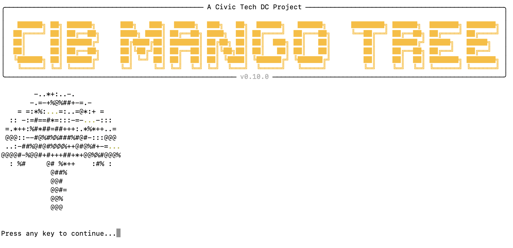

# Overview

CIB Mango Tree is a Python-based, open source toolkit for detecting coordinated inauthentic behavior (CIB) in social media datasets. It is designed for researchers, data journalists, fact-checkers, and watchdogs working to identify manipulation and inauthentic activity online.

Through an interactive terminal interface, users can import datasets, check data quality, create analysis projects, and explore results in interactive dashboards without having to writing code. This makes peer-reviewed CIB analysis methods accessible to users with little to no programming experience.

/// caption
The welcome screen of the application
///

# Roadmap

## Graphical user interface transition

We are developing a graphical user interface (GUI) built with [NiceGUI](https://nicegui.io/), which will replace both the current terminal (CLI) interface and Shiny-based dashboards. This transition aims to provide a more intuitive experience for data exploration and visualization. We anticipate to make the GUI available as part of the next minor release (v0.11.0).

!!! tip
    
    GUI development is currently underway on the `gui-prototype` branch.

After the GUI release, the CLI and Shiny dashboards will be deprecated and eventually removed in a future major version.

# Tech Stack

CIB Mango Tree relies on the following packages and data science tooling from the Python ecosystem:  

| Domain | Technologies |
|----------|--------------|
| Core | Python 3.12, Inquirer (TUI), TinyDB (metadata), Starlette & Uvicorn (web-server) |
| Data | Polars/Pandas, PyArrow, Parquet files |
| Web | Dash, Shiny for Python, Plotly |
| Dev Tools | Black, isort, pytest, PyInstaller |
