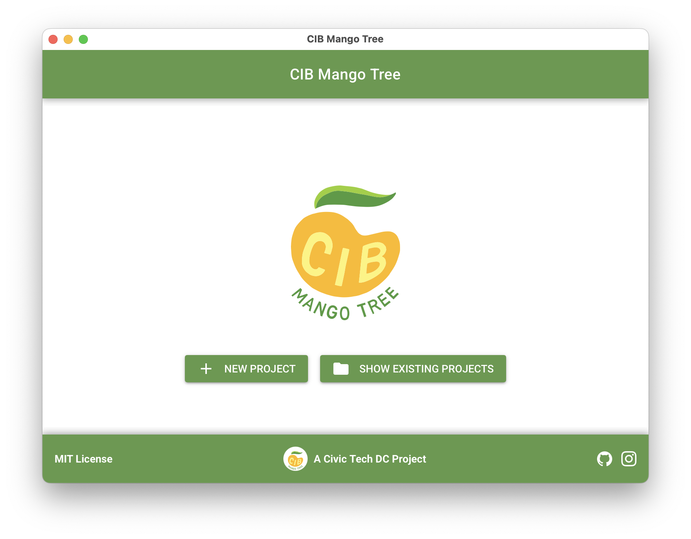

# Overview

CIB Mango Tree is a Python-based, open source toolkit for detecting coordinated inauthentic behavior (CIB) in social media datasets. It is designed for researchers, data journalists, fact-checkers, and watchdogs working to identify manipulation and inauthentic activity online.

Through an interactive graphical interface (GUI), users can import datasets, check data quality, create analysis projects, and explore results in interactive dashboards without having to writing code. This makes peer-reviewed CIB analysis methods accessible to users with little to no programming experience.

/// caption
The welcome screen of the application
///

## Roadmap

### CLI and Shiny removal

The terminal-based workflow and Shiny dashboards were removed in version v0.11.0. The graphical user interface (GUI) built with [NiceGUI](https://nicegui.io/) is now the primary interface for data exploration and visualization.

## Tech Stack

CIB Mango Tree relies on the following packages and data science tooling from the Python ecosystem:  

| Domain | Technologies |
|----------|--------------|
| Core | Python 3.12, Polars, NiceGUI (GUI), ECharts|
| Data | PyArrow, Parquet files, TinyDB |
| Dev Tools | Black, isort, pytest, PyInstaller |
