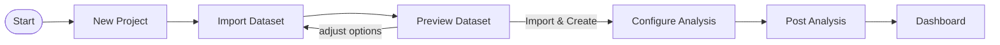
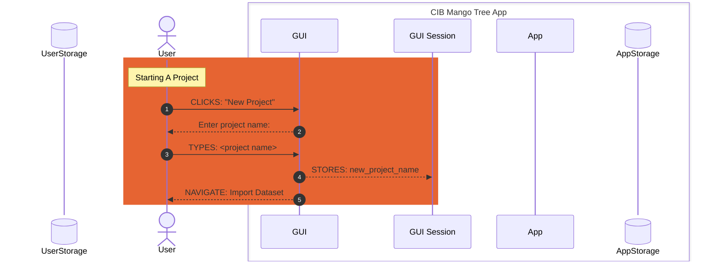
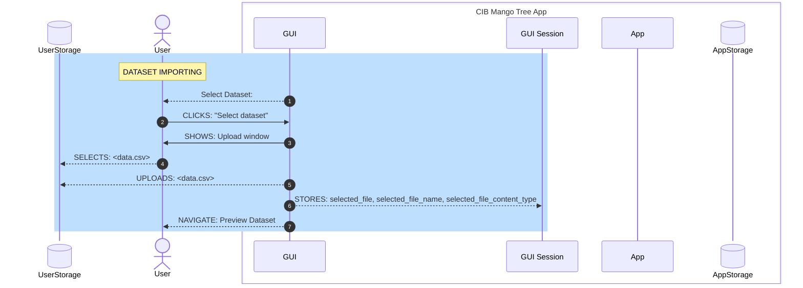
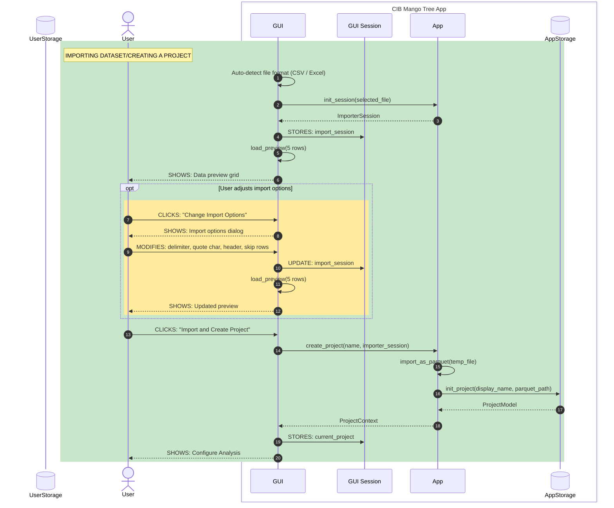

# GUI Module

The `/gui` module provides a desktop application interface for CIB Mango Tree, built on NiceGUI and launched as a native window via pywebview. It reuses the core `App` and analysis API components but remains decoupled from the terminal interface — no terminal dependencies are imported here.

## Tech Stack

- NiceGUI — Python web UI framework that renders Quasar/Vue.js components server-side and serves them to a native window via pywebview
- Bootstrap — Quasar (bundled with NiceGUI) provides a Bootstrap-like component library and CSS utilities
- Vue.js — used directly for custom components (e.g. `UploadButton`) built with Vite and loaded into NiceGUI pages at runtime

## Running in Development Mode

There are two entry points that launch the GUI:

```
python cibmangotree.py --gui
```

```
python cibmangotree_gui.py
```

Both initialize the `App` instance and call `gui_main(app=app)`. NiceGUI starts a local uvicorn server and opens a native desktop window. Set `reload=True` in `ui.run()` inside `main_workflow.py` to enable hot-reloading during development.

## Building with PyInstaller

The PyInstaller spec file at the repository root (`pyinstaller.spec`) defines the bundle configuration. It uses `cibmangotree_gui.py` as the entry point and includes:

- NiceGUI static files from site-packages
- Vue component build artifacts from `gui/components/dist/`
- SVG icons from `gui/icons/`
- Custom hooks in `./hooks/` for pywebview

Build the application:

```
pyinstaller pyinstaller.spec
```

On macOS this produces `CIBMangoTree.app` (onedir + BUNDLE). On other platforms it produces a single `CIBMangoTree` executable.

## Code Structure

- `gui/__init__.py` — package entry; exports `gui_main`
- `gui/main_workflow.py` — `gui_main(app)` registers all page routes with NiceGUI and calls `ui.run()`. Contains `_DASHBOARD_REGISTRY` mapping analyzer IDs to dashboard classes
- `gui/base.py` — `GuiPage` abstract base class using the Template Method pattern. Subclasses implement `render_content()`; `render()` handles header, content, and footer
- `gui/session.py` — `GuiSession` holds all session state (current project, selected file, analyzer, column mapping, analysis params) as a Pydantic model
- `gui/context.py` — `GUIContext` wraps the `App` instance for GUI use
- `gui/routes.py` — `GuiRoutes` defines URL paths for every page as a Pydantic model
- `gui/theme.py` — brand colors and external URLs as frozen Pydantic singletons

### Pages (`gui/pages/`)

Each page subclasses `GuiPage` and implements `render_content()`:

- `start.py` — home/landing page
- `project_select.py` / `project_new.py` — select or create a project
- `importer.py` / `dataset_preview.py` — import and preview a dataset
- `analyzer_select.py` — choose a primary or previous analyzer
- `analyzer_previous.py` — view/re-use past analyzer runs
- `analysis_config_and_run.py` — configure parameters and run analysis
- `analysis_post.py` — post-analysis options and navigation to dashboard

### Dashboards (`gui/dashboards/`)

Each analyzer gets its own dashboard page inheriting `BaseDashboardPage` (which extends `GuiPage`). New dashboards must:

1. Create `<analyzer_name>.py` with a class extending `BaseDashboardPage`
2. Implement `render_content()` with charts, tables, and controls
3. Register the class in `_DASHBOARD_REGISTRY` in `main_workflow.py`

Currently implemented:

- `ngrams.py` — `NgramsDashboardPage` for the n-grams analyzer

Planned but not yet implemented: hashtags, temporal.

### Vue Components (`gui/components/`)

Custom Vue.js components are built with Vite and loaded into NiceGUI pages. The Vite config (`vite.config.ts`) compiles `.vue` files to ES modules in `components/dist/`.

## Session Flow

### Page Navigation Overview



### 1. Starting a Project



### 2. Dataset Importing



### 3. Creating a Project


